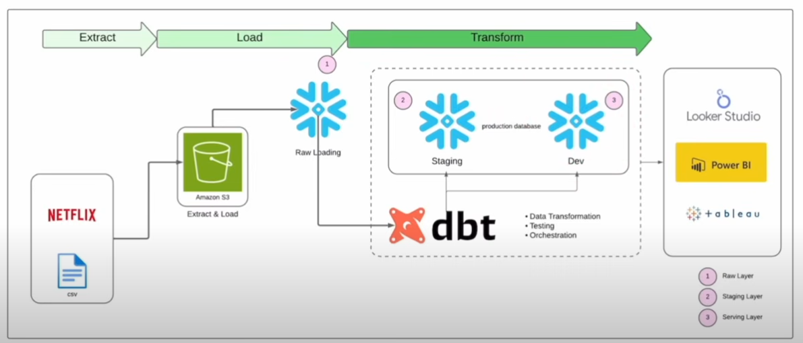

# Netflix-Style Recommendation Data Pipeline with Snowflake & dbt

## Introduction
This project demonstrates an end-to-end data engineering and analytics pipeline designed to extract, transform, and visualize Netflix data. The workflow follows the modern ELT (Extract–Load–Transform) approach and leverages cloud-based tools for scalability and automation.

Extract & Load – Netflix data, stored as CSV files, is first extracted and uploaded to Amazon S3. From there, the raw data is loaded into Snowflake in the Raw Layer.

Transform – Using dbt (Data Build Tool), the raw data is transformed into clean, analytics-ready tables. dbt handles data transformation, testing, and orchestration inside Snowflake across staging and serving layers.

Serve & Visualize – The transformed data is then made available for business users and analysts through BI tools such as Looker Studio, Power BI, and Tableau, enabling data-driven decision-making.

## Architecture

## Technology Used
1. Amazon S3 
2. Snowflake
3. dbt (Data Build Tool)
4. GitHub 
5. Business Intelligence Tools 
      1. Looker Studio
      2. Tableau
  
## Dataset Used
The MovieLens 20M dataset contains 20 million ratings and 465,000 tag applications for 27,000 movies, contributed by 138,000 users between 1995 and 2015. It includes ratings, tags, movie metadata, and a tag genome with 12 million relevance scores across 1,100 tags. This dataset is widely used for building and benchmarking recommendation systems.

Here is the dataset used - https://grouplens.org/datasets/movielens/20m/

## Scripts for project
1. [macros](macros)
2. [models](models)
3. [seeds](seeds)
4. [snapshots](snapshots)
5. [tests](tests)

